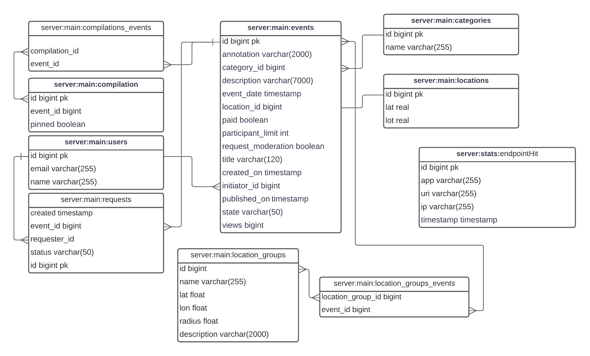

# Дипломный проект Матвеева Владимира, когорта 3 

---
В рамках дипломного проекта разработано приложение ExploreWithMe. 
 
Афиша, где можно предложить какое-либо событие от выставки до похода в кино и набрать компанию для участия в нём. 

Состоит из двух модулей: 
- Основной модуль (server) — состоящий из публичной части (publicrequest) открытый любому пользователю,
приватной (privaterequest) с доступом только авторизованным пользователям и 
административной (admin) для администраторов сервиса. 
Данный модуль обрабатывает весь спектр запросов к моделям (user, event, category,
compilation, location, participationRequest) и базам данных main и stats для хранения статистики. 
- Модуль статистики (statistics) — хранит количестве обращений пользователей к спискам событий 
и количество запросов к подробной информации о событии в базе данных stats. 
Схема взаимодействия данных. 

